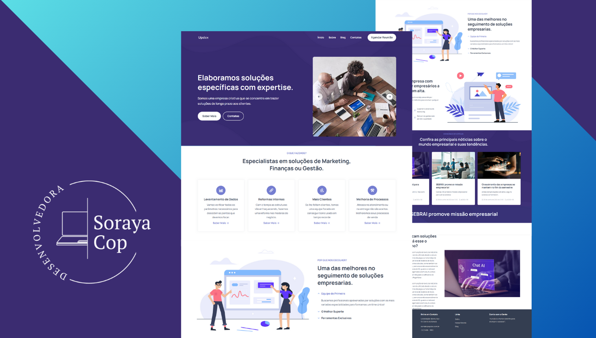

  <h2 align="center">Updex - Website Empresarial com Blog</h2>

  Updex é um site tortalmente responsivo criado em Django com  
  a ideia de servir como exemplo para uma empresa de consultoria empresarial. 

 

### Demo Screeshots

### Rodando esse Projeto

Para colocar este projeto em funcionamento, você deve começar tendo o Python instalado no seu computador. É aconselhável que você crie um ambiente virtual para armazenar suas dependências de projetos separadamente.

Você pode achar informações sobre em: [Documentação](https://docs.python.org/pt-br/3/library/venv.html).

Ative seu ambiente virtual de acordo com seu sistema. 

Em seguida, instale as dependências do projeto com:

### pip install -r requirements.txt

Agora você pode executar o projeto com este comando

### python manage.py runserver

Este projeto é **livre para usar** e não contém nenhuma licença.